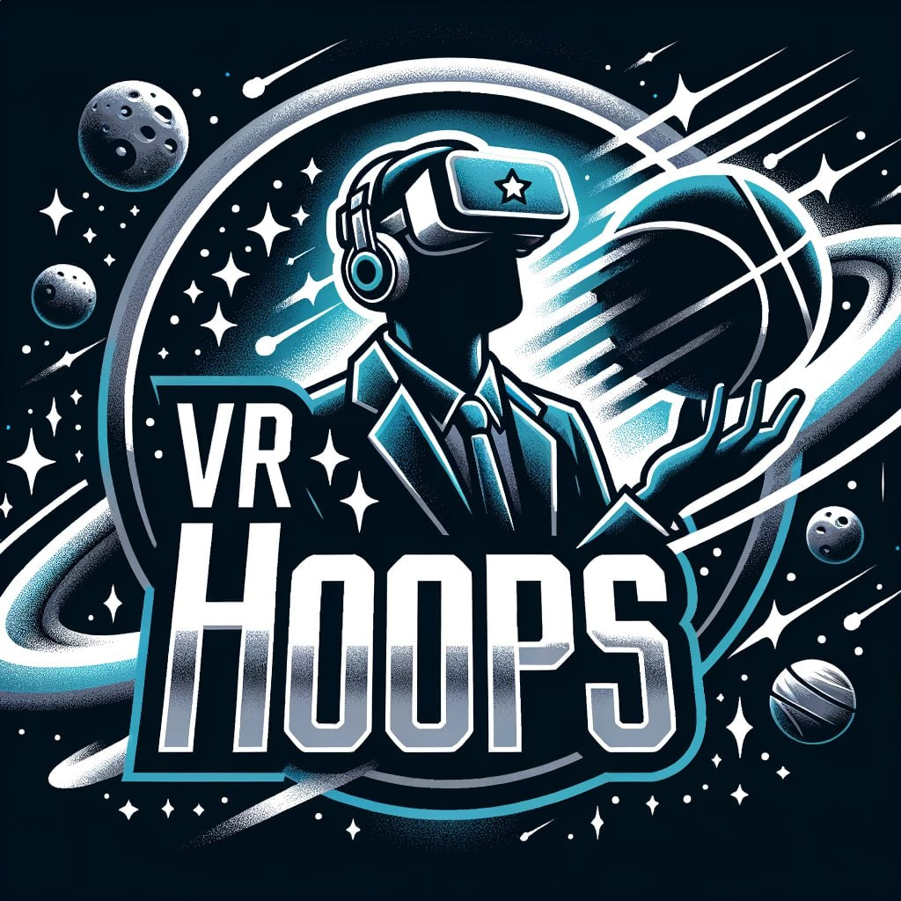

# Soup Tasting - VR Hoops

This VR game was developed using the Unity VR project template, incorporating various UGS components. Players throw spheres through distant hoops, earning points based on difficulty. Upon signup, player Cloud Save data initializes. During loading, the game fetches configuration from Remote Config, storing hoop details like position, scale, rotation, color, and score. Players commence the game by clicking the "Start Game" button on a floating Game panel near the teleport marker designed for gameplay. Remote Config also manages session length time and sphere spawn delay.

Players score when a sphere passes through a hoop. At the end of each game session, scores are sent to Cloud Code and verified against anti-cheat logic. Adjacent to the play area, there's a leaderboard panel displaying players and their best scores.

During leaderboard resets, the top scorer receives a reward. A push message notifies the client, spawning a reward panel indicating they've received XP.

## Services Used

- Authentication
- Cloud Code C#
- Cloud Code Push Messages
- Triggers
- Scheduler
- Leaderboards
- Remote Config
- Cloud Save Player Data

